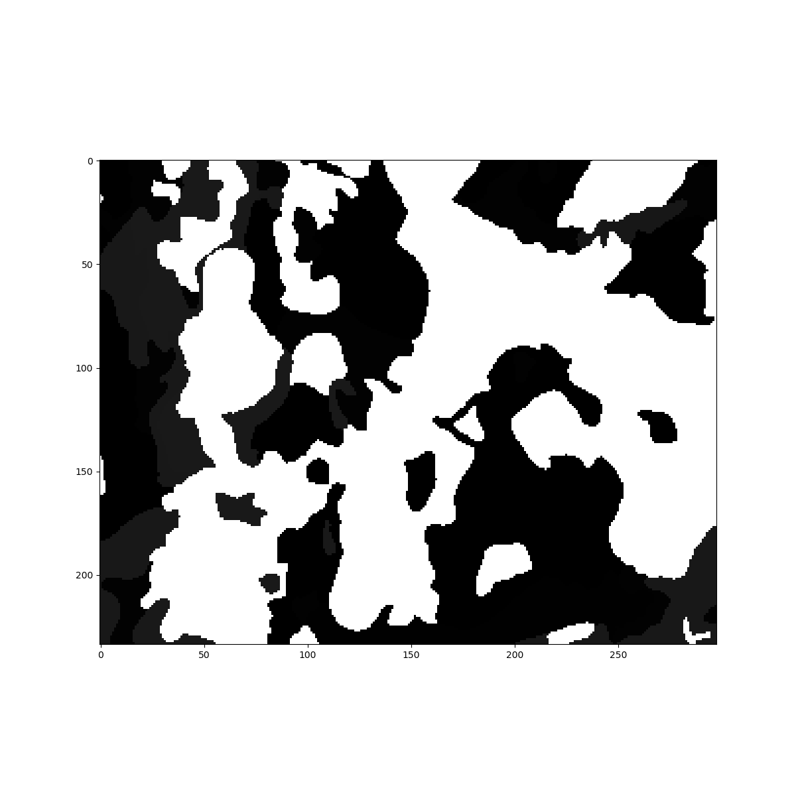

# gssurgo

[](https://pypi.python.org/pypi/gssurgo/)[](http://www.repostatus.org/#active)

The `gssurgo` python package enables open source workflows with the `gSSURGO` dataset. It provides:

* A shell script `extract_gssurgo_tif` for generating stand-alone `gSSURGO` grids. **These raster grids are distributed within file geodatabase archives and can only be extracted using ArcGIS, the fileGDB driver, or (in the case of `extract_gssurgo_tif`) the `arcpy` python package.**  

* Python functions for converting Geodatabase files to geopackage format. 
 
* Python functions for returning the results of specific `SQL` queries of `gSSURGO` data.
 
* Python functions for referencing query results to corresponding (raster) grid cells.

## Prereqs

* The intial `tif` (grid) extraction step requies the `arcpy` python module. This step assumes that a python executable linked to `arcpy` can be found at `C:\Python27\ArcGIS10.3\python.exe`. Edit [bin/extract_gssurgo_tif](bin/extract_gssurgo_tif) to enable alternate locations.

* Remaining operations require the dependencies listed in [environment.yml](environment.yml) and [requirements.txt](requirements.txt). If using Anaconda, make sure you have the **64bit** version. You can install an Anaconda virtual environment with:

```
conda env create -n gssurgo -f environment.yml
source activate gssurgo
```

## Installation

```
# local install
# pip install -e  . 

# development install 
pip install git+git://github.com/jsta/gssurgo.git

# development upgrade
# pip install --upgrade git+git://github.com/jsta/gssurgo.git
```

## Usage

### 1. Extract tif and build gpkgs

```
extract_gssurgo_tif 'path/to/gSSURGO_STATE.gdb/MapunitRaster_10m' 'path/to/STATE.tif'
```

```
import gssurgo
gssurgo.build_gpkg("path/to/gSSURGO_STATE.gdb", "path/to/gSSURGO_STATE.gpkg")
```

### 2. Generate an Area of Interest (AOI)

```
gssurgo.aoi(in_raster_path = "tifs", out_raster = "path/to/aoi.tif", xmax = -88.34945, xmin = -88.35470, ymin = 38.70095, ymax = 38.70498)
```

### 3. Pull specific variable and merge with corresponding tif

```
gssurgo.query_gpkg(src_tif = "path/to/aoi.tif", sql_query = 'SELECT mukey, nonirryield_r FROM mucropyld WHERE (cropname = "Corn")', out_raster = "path/to/aoi_results.tif")

gssurgo.query_gpkg(src_tif = "tests/aoi.tif", sql_query = 'SELECT mukey, nonirryield_r FROM mucropyld WHERE (cropname = "Corn")', out_raster = "path/to/aoi_results.tif")
```

> The `sql_query` parameter must give a two column result of `mukey` and `some_variable`.

### 4. Visualize output

```
gssurgo.viz_numeric_output("path/to/aoi_results.tif", "path/to/aoi_results.png")
```


